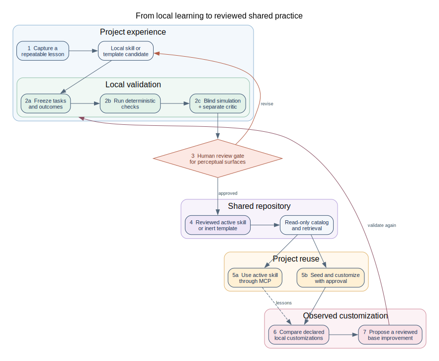

# skills-mcp

`skills-mcp` is a [Model Context Protocol](https://modelcontextprotocol.io)
server and a shared library of agent workflows. It helps teams reuse engineering
practice that has already worked in real projects while preserving the judgment,
validation, and human review needed to adapt that practice safely.

## Why use this repository

Use it when you want an agent to follow a repeatable workflow—such as keeping an
engineering journal, recommending relevant skills, or documenting a feature—or
when a project needs its own customized version of a shared workflow.

Installing the server exposes every **active skill** as an MCP tool. The repository
also carries **inert templates** that are never invoked directly: an agent can
selectively seed one into a project, customize it, and record its provenance. This
creates two short paths:

- install the server, ask which skills fit your project, and use active skills;
- contribute a lesson from project experience as a new or improved skill or
  template.

You can install `skills-mcp` with Homebrew, a one-line install script, or from
source (see below). A coding-agent plugin is not distributed yet.

## How project lessons become shared skills



The diagram is a quick visual map. This numbered workflow is its exact textual
equivalent:

1. **Capture project experience** as a local skill or template candidate when a
   useful lesson repeats.
2. **Validate the candidate** by freezing tasks and outcomes, running deterministic
   checks, and using blind simulations plus a separate critic.
3. **Pass the human review gate** for diagrams, onboarding, navigation, and other
   perceptual surfaces; revise and re-review when needed.
4. **Share an active skill or inert template** in the repository only after the
   applicable checks and review pass; the read-only catalog exposes its metadata.
5. **Use or seed it in projects**: invoke active skills through MCP, or seed and
   customize an inert template after approval.
6. **Observe local customization** through explicit, authorized comparison of
   declared instance changes—never hidden telemetry or automatic edits.
7. **Propose a reviewed base improvement** when recurring evidence supports it,
   then send the proposal through validation again rather than changing the base
   automatically.

The DOT source is authoritative at
[`docs/skill-feedback-loop.dot`](docs/skill-feedback-loop.dot); the SVG is rendered
beside it and checked for freshness in CI.

## Install with Homebrew

The quickest way to get `skills-mcp` on Apple Silicon macOS or x86_64 Linux is
the IOP Systems Homebrew tap:

```sh
brew install iopsystems/iop/skills-mcp
```

This installs a bottled (prebuilt) `skills-mcp` binary. Bottles are published for
Apple Silicon macOS (Sonoma and Sequoia) and x86_64 Linux; on other platforms
Homebrew builds the same formula from source. Pass `--build-from-source` to
compile locally on any platform.

### Install script

If you do not use Homebrew, the hosted install script downloads the prebuilt
binary that matches your platform from the latest GitHub release, verifies its
SHA-256 checksum, and installs it into `~/.local/bin`:

```sh
curl -fsSL https://raw.githubusercontent.com/iopsystems/skills-mcp/main/install.sh | sh
```

Review the [script](install.sh) before piping it to a shell. When no prebuilt
binary matches your platform it falls back to a `cargo install` build, so a Rust
toolchain is still useful to have. Set `SKILLS_MCP_VERSION` to pin a release
tag other than the latest.

## Install from source

### Prerequisites

- Git;
- a current [Rust toolchain](https://rustup.rs/) with Cargo; and
- an MCP-capable coding agent or client.

Apple Silicon macOS is the most common environment; Linux is also supported for
source builds. Install the current repository version with:

```sh
cargo install --git https://github.com/iopsystems/skills-mcp --locked
```

This command accesses the network, compiles Rust locally, and installs
`skills-mcp` into Cargo's binary directory (normally `$HOME/.cargo/bin`). Confirm
that directory is on `PATH`:

```sh
command -v skills-mcp
```

If compilation fails, first update the Rust toolchain and retry. For contributor
builds from a checkout, use `cargo build --locked`; the debug binary is
`target/debug/skills-mcp`.

Configure an MCP client to spawn the installed binary. Replace the command with
the absolute path printed by `command -v skills-mcp` if the client does not inherit
your shell `PATH`:

```json
{
  "mcpServers": {
    "skills-mcp": {
      "command": "/absolute/path/to/skills-mcp"
    }
  }
}
```

Restart or reconnect the client, list its MCP tools, and confirm that
`skill_catalog` is present. If it is missing, run the command path directly from a
terminal to check that it starts, then inspect the client's MCP logs for its
effective `PATH` and configuration.

## Using the server

`skills-mcp` is an MCP server, not a command-line tool—you never run it
directly. Launched on its own it just waits for JSON-RPC on standard input. Your
MCP client spawns it from the `mcpServers` configuration above, and you use it by
talking to your connected agent.

Once connected, the server exposes three families of tools:

- **Active skills** as invocable workflow tools—`recommend-skills`,
  `plan-feature`, `engineering-journal`, `seed-skill-template`, `vault-search`,
  and more. Ask your agent to run one by name; the tool returns workflow
  instructions for the agent to follow, and nothing is copied into your project.
- **`skill_catalog`** and **`skill_template_get`** for read-only browsing of every
  active skill and template, and for retrieving a template's declared files.
- **`vault_search`**, **`vault_edges`**, **`vault_reflect`**, and related
  **`vault_*`** tools for querying the knowledge vault.

A good first step is to ask your agent to call `skill_catalog`, or to ask the
recommendation question below. The only time you feed the binary directly is the
raw JSON-RPC check in the "Raw MCP smoke and debugging" section.

## Ask for recommendations and use an active skill

Once the server is connected, ask your agent exactly:

> which skills here should I install and use for my project XYZ? Give me some recommendations

Replace `XYZ` with your project and relevant constraints. The active
`recommend-skills` workflow inspects local project evidence and calls the read-only
`skill_catalog`; it ranks a minimal set as **use through MCP**, **seed and customize locally**,
**do not adopt**, or **missing capability**. It does not install or modify anything.

To use a recommended active skill, ask the connected agent to invoke that named MCP
tool. The tool returns the workflow instructions for the agent to follow. Active
skills are already exposed by the installed server, so they do not need to be
copied into the project.

## Active skill, inert template, or installed instance?

| Active skill | Inert template | Installed instance |
| --- | --- | --- |
| Invocable instruction exposed by the MCP server | Read-only catalog content, never directly invocable | Project-local copy under a harness discovery path |
| Lives at `skills/<name>/SKILL.md` | Lives at `templates/<id>/` and is indexed by `templates/catalog.yaml` | Usually lives at `.agents/skills/<name>/` |
| Use through MCP without copying it | Seed and customize locally only when the project needs adaptation | Use the customized workflow through the project's harness |
| Updated with the server repository | Retrieved only from its declared manifest files | Tracks base version, immutable commit, digests, and local customizations in `template-state.yaml` |

Current adoption surfaces include:

| Kind | IDs | Purpose |
| --- | --- | --- |
| Active skills | `recommend-skills`, `seed-skill-template`, `engineering-journal`, plus inquiry and vault workflows | Invocable shared workflows |
| Inert templates | `document-feature-skill`, `engineering-journal-skill` | Project-specific workflow bases |
| Installed instance in this repository | `.agents/skills/document-feature/` | Customized documentation workflow used to produce this README |

Use `skill_catalog` for the complete current active-skill and template metadata.
Use `skill_template_get` to retrieve only a template's manifest-declared files.

## Seed and customize a template

Ask the agent to invoke `seed-skill-template` after choosing a recommended
template. Seeding is intentionally approval-gated:

1. approve the template selection, which authorizes only read-only discovery;
2. review the proposed destination, exact files, compatibility links,
   customizations, source commit, conflicts, and validation;
3. give separate explicit approval of that exact write plan before any mutation.

The workflow refuses dirty or unknown source provenance and never overwrites an
existing file, directory, or symlink. A new instance records a stable identity,
base version, immutable source commit, digests, merge strategies, dates, and
declared customizations in `template-state.yaml`. Upgrades compare the verified
old base, current local instance, and new base; they stop on missing provenance,
digest mismatch, or unresolved intent.

## Contribute lessons and validate changes

Concrete development experience is welcome. Choose the boundary that matches the
lesson:

- add or improve an invocable workflow at `skills/<name>/SKILL.md`;
- add or improve an inert reusable base under `templates/<id>/`, update its
  `template.yaml` digests, and register a new template in
  `templates/catalog.yaml` when needed;
- improve a project-local installed instance first when the lesson is not yet
  general enough for the shared base.

Record durable intent and evidence in
[`docs/journal/`](docs/journal/README.md). Preserve the active/inert boundary, use
test-driven development for deterministic contracts, and evaluate workflow
changes with a baseline, fresh forward simulation, and separate critic. Human
review is mandatory for diagrams, major hierarchy or navigation changes,
onboarding narratives, and other perceptual results.

Run the relevant focused test first, then the full local checks:

```sh
cargo fmt --all -- --check
cargo clippy --all-targets --locked -- -D warnings
cargo test --locked
cargo build --release --locked
./scripts/render-diagrams.sh --check
./scripts/mcp-smoke.sh
```

The smoke test requires `jq`; diagram checks require Graphviz `dot`.

## Architecture and repository layout

The server embeds active skills and validated template bytes at compile time and
speaks MCP over standard input/output. No sidecar skill directory is required at
runtime.

| Path | Responsibility |
| --- | --- |
| `src/main.rs` | MCP initialization, tool schemas, routing, and responses |
| `src/templates.rs` | Template manifest validation, safe retrieval, and aggregate digests |
| `build.rs` | Build-time source repository, commit, and template dirty-state provenance |
| `skills/` | Active, invocable skill instructions embedded as MCP tools |
| `templates/` | Inert, manifest-declared bases embedded for read-only retrieval |
| `.agents/skills/` | Project-local installed instances; not part of the MCP bundle |
| `tests/` | Registry, tool, workflow, installed-instance, and documentation contracts |
| `docs/journal/` | Durable implementation reasoning and evidence |

The two programmatic adoption tools are deliberately read-only. `skill_catalog`
combines active-skill metadata with inert-template summaries without returning
bodies. `skill_template_get` returns only files declared by a validated manifest.
Mutation remains in the approval-gated agent workflow, outside the Rust server.

## Raw MCP smoke and debugging

This project is an MCP stdio server rather than a flag-oriented CLI, so its
rendered interface is the actual `initialize`, `tools/list`, and `tools/call`
responses. Build and verify that interface with:

```sh
cargo build --locked
./scripts/mcp-smoke.sh
```

The smoke script starts one server session, initializes it, lists tools, calls
`skill_catalog`, retrieves `document-feature-skill` with `skill_template_get`, and
verifies the returned file and aggregate SHA-256 digests.

For direct debugging, each MCP request is one JSON line. This example initializes
the debug binary, lists tools, and calls `skill_catalog` in one session:

```sh
(
  printf '%s\n' '{"jsonrpc":"2.0","id":1,"method":"initialize","params":{"protocolVersion":"2025-03-26","capabilities":{},"clientInfo":{"name":"manual","version":"0.1.0"}}}'
  printf '%s\n' '{"jsonrpc":"2.0","method":"notifications/initialized","params":{}}'
  printf '%s\n' '{"jsonrpc":"2.0","id":2,"method":"tools/list","params":{}}'
  printf '%s\n' '{"jsonrpc":"2.0","id":3,"method":"tools/call","params":{"name":"skill_catalog","arguments":{}}}'
) | ./target/debug/skills-mcp
```

Responses are JSON lines on standard output. Pipe them through `jq` to inspect
specific IDs; server diagnostics go to standard error.

## Present limitations and roadmap

Prebuilt, checksummed binaries and a Homebrew bottle are now published for Apple
Silicon macOS and Linux, but there is still no automatic cross-project survey.
Harness discovery can vary by coding agent, and template upgrades stop rather
than guess when provenance or historical bases are unavailable. Agent
evaluations provide comprehension evidence but never prove human usability.

See [assumptions and limitations](docs/assumptions-and-limitations.md) for the
current boundaries. The [roadmap](docs/roadmap.md) covers authorized adoption
surveys, evidence-based template evolution, and eventual evaluation of plugin
distribution.

The package is dual-licensed under MIT or Apache-2.0.
